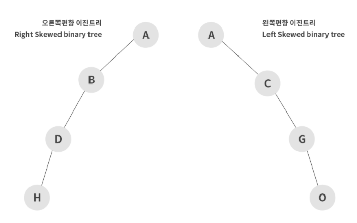
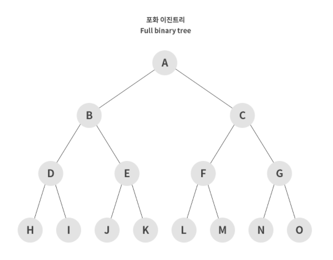
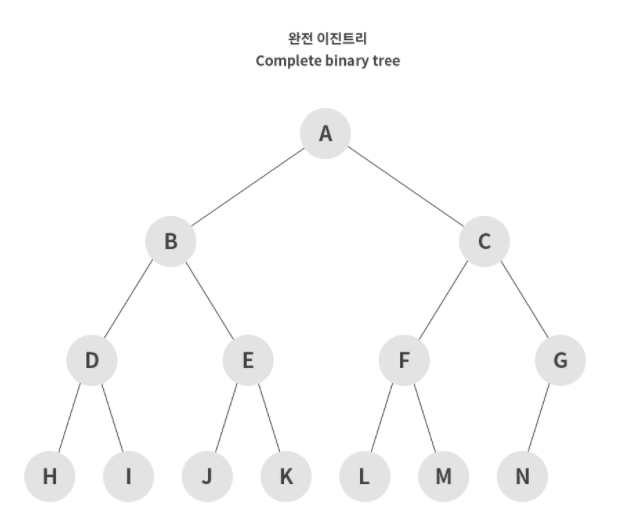

# **Tree**

## Index

- [개념](#개념)
  - [정의](#정의)
  - [특징](#특징)
- [트리 순회](#트리-순회)
  - [전위 순회](#전위-순회preorder)
  - [중위 순회](#중위-순회inorder)
  - [후위 순회](#후위-순위postorder)
- [이진 트리](#이진-트리binary-tree)
- [이진 탐색 트리](#이진-탐색-트리binary-search-tree)

## 개념

### 정의


- **트리**는 **그래프의 일종으로 정점과 간선을 이용하여 데이터의 배치 형태를 추상화한 자료구조**이다.
- 서로 다른 두 노드를 연결하는 길이 하나뿐인 그래프를 트리라고 한다.
- **힙(Heap)**을 구현하는 방법 중 하나가 트리이다.
- 계층적인 관계 표현에 쓰이기 때문에, OS의 File System, 대용량의 데이터를 계층적으로 저장할 때 많이 사용된다.

### 특징

- 일반적으로 **대상 정보의 각 항목들을 계층적으로 구조화 할 때** 사용하는 비선형 자료구조
- 데이터의 저장 자체보단 **저장된 데이터를 효과적으로 탐색**하기 위해 사용
- **사이클이 없으며** 루트노드를 제외한 모든 노드는 단 하나의 부모노드를 가진다.

## 트리 순회

- 트리의 각 노드를 체계적인 방법으로 탐색하는 과정
- 노드를 탐색하는 순서에 따라 세 가지 방법이 있다.

### 전위 순회(Preorder)


- 루트노드 -> 왼쪽 서브트리 -> 오른쪽 서브트리
- **깊이 우선 순회**라고도 한다.

### 중위 순회(Inorder)


- 왼쪽 서브트리 -> 루트노드 -> 오른쪽 서브트리
- **대칭 순회**라고도 한다.

### 후위 순위(Postorder)


- 왼쪽 서브트리 -> 오른쪽 서브트리 -> 루트노드

## 이진 트리(Binary Tree)

- 트리 자료 구조 중, 가장 기본이 되는 트리가 **이진 트리(Binary Tree)** 구조이다.
- 이진 트리는 **2개 이하의 자식 노드**를 가진다.

### 이진 트리 종류

#### 편향 이진 트리(Skewed Binary Tree)



- 하나의 차수로만 이루어져 있는 경우
- 이러한 구조는 배열과 같은 선형 구조이므로 `leaf node(가장 아래쪽에 위치한 노드)` 탐색 시, 모든 데이터를 탐색해야 한다는 단점이 있어서 비효율적이다.

#### 포화 이진 트리(Full Binary Tree)



- `leaf node`를 제외한 모든 노드의 차수가 2개로 이루어져 있는 경우를 의미한다.
- 해당 차수에 몇 개의 노드가 존재하는지 바로 알 수 있기에 노드 개수를 파악할 때 용이하다.

#### 완전 이진 트리(Complete Binary Tree)



- 포화 이진 트리와 같은 개념이지만, **모든 노드가 왼쪽부터 차근차근 생성되는 이진 트리**이다.
- **힙은 완전 이진 트리의 일종**이다.

## 이진 탐색 트리(Binary Search Tree)

**이진 탐색 트리**는 탐색을 위한 이진 트리 기반의 자료 구조이다.

- **왼쪽 자식 노드 < 부모 노드 < 오른쪽 자식 노드**의 구조를 가진다.
- **중복된 값을 허용하지 않는다.**
- 시잔 복잡도는 `O(logN)`이다. 이는 배열보다 효율적이다.

`[28, 21, 15, 14, 32, 25, 18, 11, 30, 19]`를 이진 탐색 트리로 만들면 다음과 같다.


이렇게 이진 탐색 트리를 만드는 이유는 효율적으로 탐색할 수 있기 때문이다.
원하는 값을 찾을 때까지 현재의 노드값보다 찾고자하는 값이 작으면 왼쪽으로, 크면 오른쪽으로 움직이면 된다.
이 방법은 원하는 값을 더 빠르게 찾는다.


<details>
<summary>이진 탐색 트리 구현 코드</summary>

```python
class Node:
    def __init__(self, data):
        self.left = None
        self.right = None
        self.data = data

    # 이진 탐색 트리에 노드 삽입
    def insert(self, data):
        if self.data:
            if data < self.data:
                self.left = Node(data) if self.left is None else self.left.insert(data)
            elif data > self.data:
                self.right = Node(data) if self.right is None else self.right.insert(data)
        else:
            self.data = data

    # 이진 탐색 트리에서 찾고자하는 값 탐색
    def search(self, want_word):
        if want_word < self.data:
            return str(want_word) + " Not Found" if self.left is None else self.left.search(want_word)
        elif want_word > self.data:
            return str(want_word) + " Not Found" if self.right is None else self.right.search(want_word)
        else:
            print(str(self.data) + ' is Found')

    # 이진 탐색 트리 출력
    def print_tree(self):
        if self.left:
            self.left.print_Tree()
        print(self.data)
        if self.right:
            self.right.print_Tree()


if __name__ == "__main__":
    root = Node(12)
    root.insert(6)
    root.insert(14)
    root.insert(3)
    print(root.search(7))
    print(root.search(14))
```

```shell
7 Not Found
14 is Found
```

</details>

## 참고 문헌

- [kdb.velog](https://velog.io/@kimdukbae/자료구조-트리-Tree)